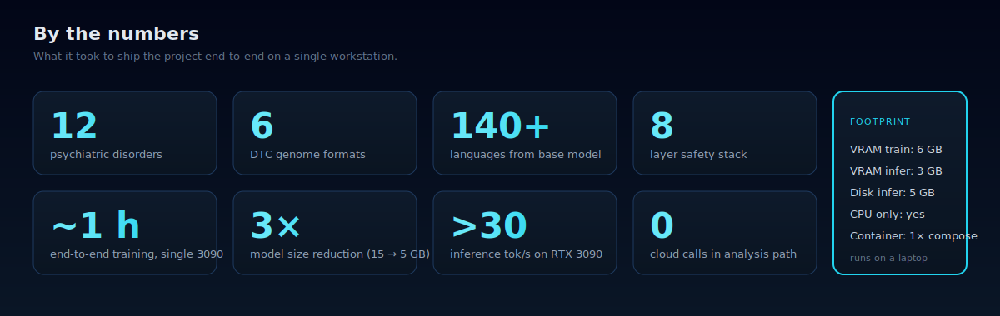
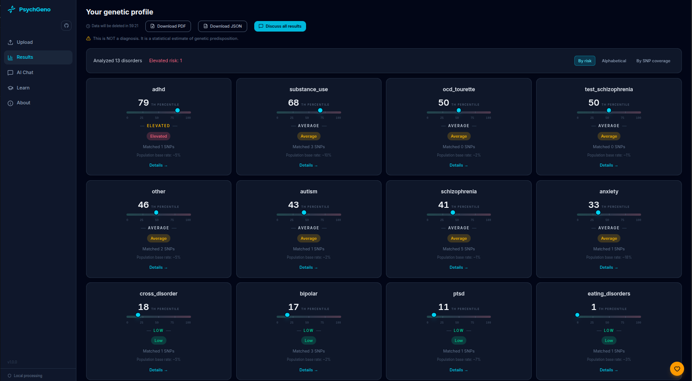
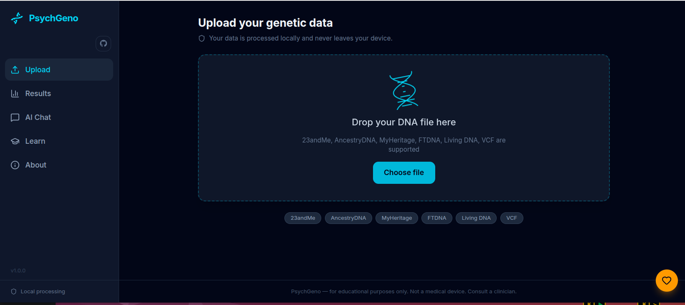
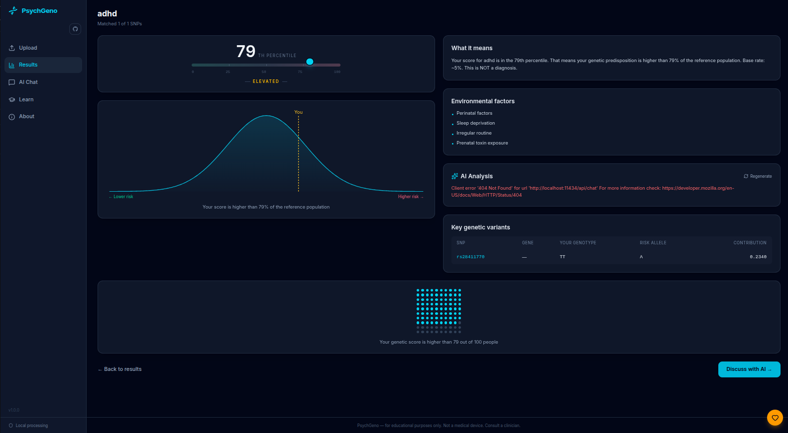
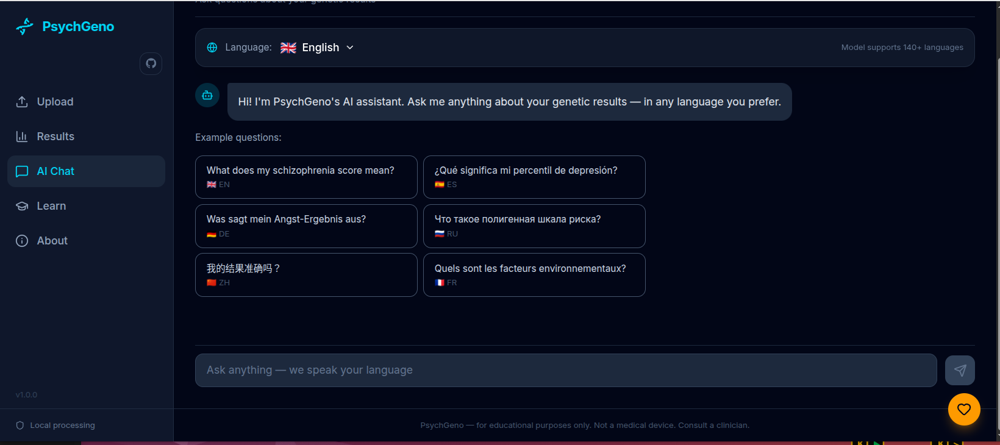
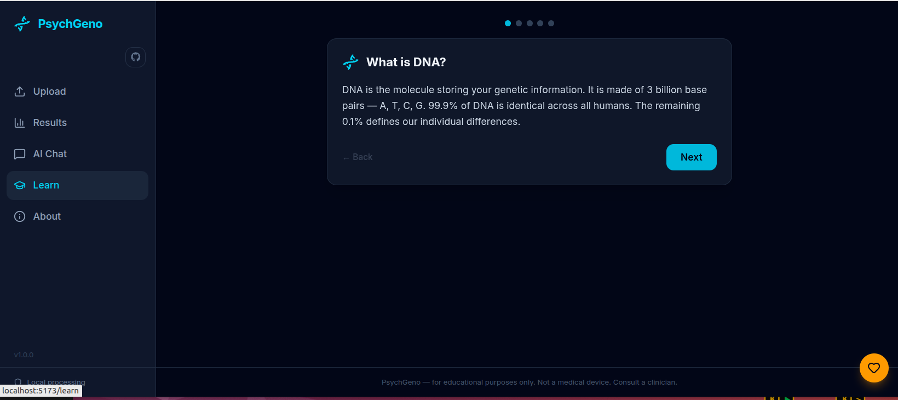
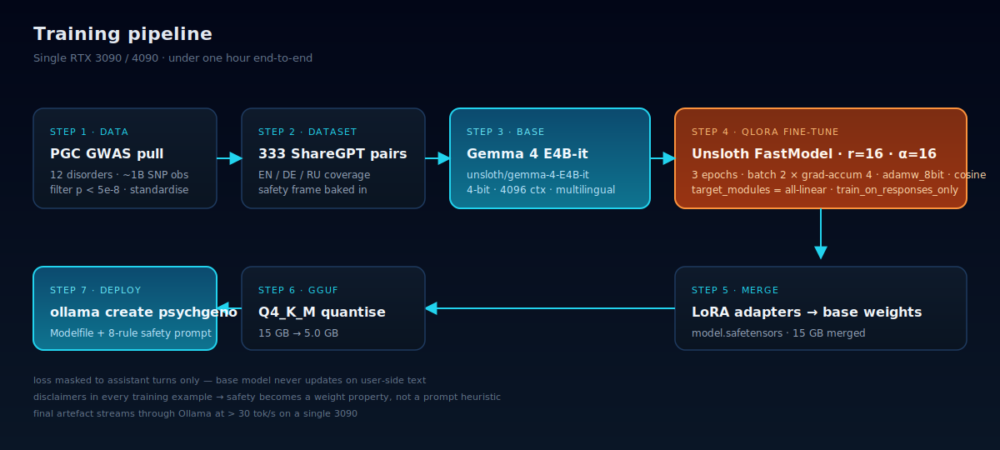
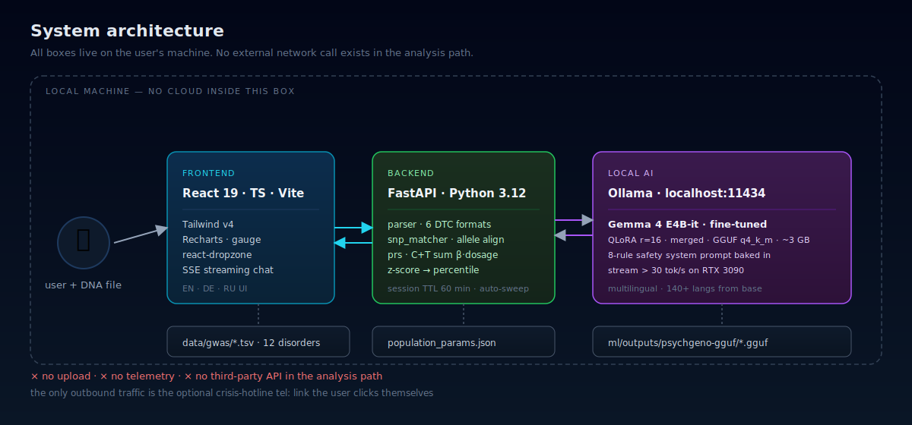
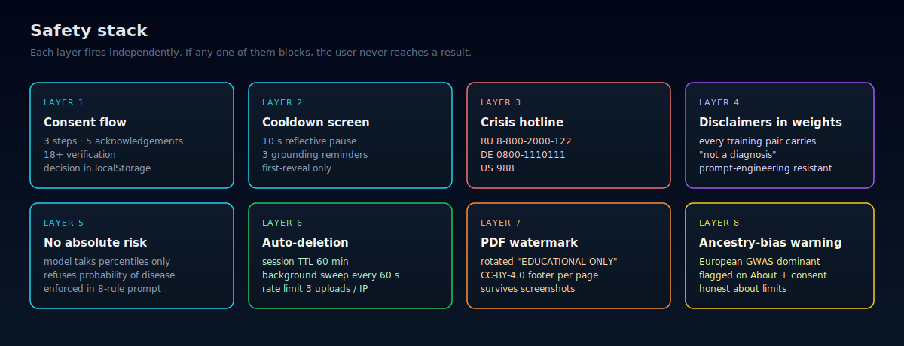

# PsychGeno

### Privacy-first psychiatric genomics, on your own GPU

**Serghei Brinza** · AI Engineer · Vienna

*This repository is a public case study. The source code, training data and trained weights are kept in private repositories and are not redistributed here.*

 

> A consumer-genome file goes in. A calibrated polygenic risk picture across 12 psychiatric disorders comes out, with a fine-tuned Gemma 4 explaining every percentile in plain language. The whole pipeline runs on the user's own GPU. No upload. No cloud. No third-party API in the analysis path.

---

## What it is

The first time I opened my own 23andMe raw file, I scrolled through 600,000 SNPs looking for anything about depression. There wasn't a word.

Earwax type, caffeine metabolism, lactose persistence — the report was full of cute traits. Mental health, the field with the strongest GWAS coverage in modern psychiatry, was missing. Not because the science isn't there. The Psychiatric Genomics Consortium has published summary statistics for schizophrenia, bipolar, ADHD, autism and a dozen others, each backed by hundreds of thousands of genomes. The data is open. The pipelines are not.

The few tools that bridge the gap ask you to upload your genotype to their cloud. Which is exactly the moment most people put the file back in a folder and never look at it again.

PsychGeno is the version I wanted to exist. You hand it a file. The file never leaves your machine. Twelve PRS calculations run locally, get standardised against population parameters, and surface as percentiles with bell curves and SNP tables. A Gemma 4 model — fine-tuned for this domain, served by your own Ollama — explains every score in plain language. In English, German or Russian, and any other tongue Gemma natively speaks.

It was built for the **Gemma 4 Good Hackathon** on Kaggle and tested end-to-end on a single workstation. Upload, parse, score, render, chat, PDF export, auto-deletion — every path was exercised against real 23andMe and VCF files until it ran clean.

---

## By the numbers

---

## What it looks like

*Results dashboard. Twelve cards, sorted by percentile. One disorder flagged elevated, the rest clustered around the population mean — the picture you'd expect from a real genome rather than a cherry-picked demo.*

*Upload screen. 23andMe, AncestryDNA, MyHeritage, FTDNA, Living DNA, VCF. Gzipped variants welcome. The file never leaves the machine — that promise is structural, not a setting.*

*Per-disorder detail. Bell curve, position on the curve, the SNPs that drove the contribution, environmental factors that matter, and an AI explanation streamed token-by-token over Server-Sent Events.*

*Multilingual chat. Six example languages shown. The base model handles 140+ natively, so a user in Polish or Vietnamese gets answered in Polish or Vietnamese without any flag-flipping in the UI.*

*Learn mode. Five steps designed for someone who's never heard the word "polygenic" before, sized for a phone screen.*

---

## Why Gemma 4 E4B specifically

The model is `gemma-4-E4B-it`. The choice isn't arbitrary, and the constraints that drove it are the same constraints any local-first medical-adjacent app runs into.

E4B means *effective 4 billion parameters*. It's the small-but-serious tier of Gemma 4 — bigger than the nano models, smaller than the 12B and 27B siblings. After 4-bit quantisation it sits comfortably in 6 GB of VRAM at training time and around 3 GB at inference, which means a single RTX 3090 or 4090 finishes a full QLoRA fine-tune in under an hour, and an old laptop with a decent iGPU can serve the result through Ollama. Nothing about the deployment story requires a datacentre.

It's instruction-tuned out of the box. The `-it` suffix matters. We don't want to teach the base model what a chat is — we want to teach it what *psychiatric genetics conversations* look like, and let the existing instruction-following behaviour handle the rest. Three epochs over a few hundred curated pairs is enough to shift register; teaching instruction-following from scratch would need an order of magnitude more data.

It speaks 140+ languages. That's the one feature you can't replicate by fine-tuning. The training data is mostly English with German and Russian slices, but a user typing in Polish or Vietnamese still gets an answer in Polish or Vietnamese — the base model already knows how. For an app whose target audience is anyone who's ever sent saliva to a lab, that property is non-negotiable.

It quantises cleanly to GGUF. The Unsloth pipeline exports straight to `q4_k_m`, the sweet spot for llama.cpp-family runtimes. You lose maybe 1-2% on benchmarks compared to bf16, and you get a 5 GB file you can serve from a USB stick. Larger Gemma variants would have given marginally better explanations at twice the memory; not worth it for a tool that explicitly tells users to consult a clinician for anything that matters.

There's also the prosaic reason. Unsloth ships a 4-bit pre-quantised version with a working chat template (`gemma-4`) and `train_on_responses_only` support out of the box. That stack just works. When you're racing a hackathon deadline without a team, "just works" is its own argument.

---

## Training methodology

The fine-tune is a textbook Unsloth + TRL setup, with a couple of decisions worth flagging.

**QLoRA, not full fine-tune.** LoRA rank 16, alpha 16, no dropout, targeting `all-linear` modules. On Gemma 4 E4B that's roughly 0.5% of parameters trained — enough capacity to shift register and learn domain framing, not enough to overfit on a few hundred pairs.

**4-bit base, bf16 LoRA.** The base weights live in 4-bit (`bitsandbytes`-style nf4) for VRAM economy; the LoRA adapters are bf16 for stable gradients. Standard QLoRA recipe, nothing exotic — but it's what makes a 3090 enough.

**Loss masked to assistant turns only.** Trainable tokens cover only what the model is supposed to *say*, never what the user typed. Implemented through TRL's `train_on_responses_only` with the `gemma-4` chat template's turn boundaries. Without this, the model partly learns to generate user prompts — which sounds harmless, but in a safety-sensitive context it lets adversarial prompt fragments shape the output distribution.

**Hand-curated dataset, not synthetic.** A few hundred ShareGPT-style pairs covering twelve disorders, percentile interpretation, signal-SNP explanations, safety fallbacks, gene Q&A, cross-disorder comparisons, and EN/DE/RU translations. Every example carries the "not a diagnosis / environment matters / consult a clinician" framing — so safety becomes a weight property, not a prompt heuristic.

**Three epochs, cosine schedule, `adamw_8bit`.** Three was the sweet spot in eval — at two the model still hedged generically, at four it started memorising specific phrasings. Optimiser is the 8-bit AdamW from bitsandbytes; on this scale it costs no measurable accuracy and saves enough VRAM to bump batch size.

**Quantise after merge.** LoRA adapters get merged into the base, then the merged model is quantised through `save_pretrained_gguf` to `q4_k_m`. Final file: 5 GB. Roughly 3× compression versus bf16 merged, ~1-2% benchmark impact. This is the artefact that ends up in Ollama.

The whole pipeline — data pull, dataset generation, training, merge, quantise, Ollama register — runs end-to-end in under one hour on a single RTX 3090.

---

## System architecture

The dotted boundary is the important part. The model lives entirely inside it. Backend, frontend, Ollama, GWAS data, session store — everything is on the user's machine. The only outbound traffic in the entire user journey is the optional `tel:` link the user clicks themselves on the crisis-hotline button.

**Backend.** FastAPI on Python 3.12. Async request handling, Pydantic schema validation, an in-process session store with TTL-based auto-deletion that runs on a 60-second background sweep. Streaming chat responses go out as Server-Sent Events from the Ollama proxy, with backpressure handled at the HTTP layer rather than buffered in memory. PRS computation uses the `snps` library for genome parsing across six DTC formats, then `pandas`/`numpy` for the dosage-weighted sum and `scipy.stats` for the z-score → percentile calibration. PDF exports use `reportlab` with a rotated educational-only watermark stamped on every page.

**Frontend.** React 19 with TypeScript on Vite, Tailwind v4 (with the `@theme` block, no `tailwind.config.js`), Recharts for distributions, `react-gauge-component` for the percentile dials, `react-dropzone` for the file upload, `react-markdown` for the streamed AI answers, `react-router-dom` for navigation, `lucide-react` for icons. UI ships in EN/DE/RU with a `LanguageContext` that persists across sessions; the AI chat itself works in any of the 140+ Gemma supports.

**AI runtime.** Ollama on `localhost:11434`, serving the merged + quantised Gemma 4 E4B-it through a Modelfile that carries the 8-rule safety system prompt. Streaming throughput is comfortably above 30 tok/s on a 3090, well below human reading speed — the perceived latency floor is the network-less SSE pipe, not the model.

**Container topology.** A single `docker compose` file with NVIDIA GPU passthrough. Frontend behind nginx on port 80, backend on 8000, Ollama on the host. Three services, one network, no orchestration ceremony.

---

## Engineering decisions worth flagging

A few non-obvious choices that shaped the project.

**Disclaimers in weights, not just prompts.** Every fine-tuning example carries the "not a diagnosis" frame, so the safety property survives prompt injection. Strip the system prompt and the model still behaves; the failure mode is "less polished," not "suddenly gives medical advice." That asymmetry is hard to get from system prompts alone.

**Percentiles only, never absolute risk.** PRS for these conditions explains 1-10% of variance on a good day. Translating that to "you have a 23% chance of developing schizophrenia" is statistically wrong and clinically destructive. The model is trained — and the system prompt enforces — to talk about position relative to a reference distribution, never about absolute probabilities.

**Cooldown screen before first reveal.** A 10-second pause with three grounding lines, before the user sees their results. This is a deliberate friction, not a UX bug. Genetic results about mental-health risk should not arrive between two scrolls of a feed.

**Auto-deletion, not opt-in retention.** Sessions expire after 60 minutes via a background task. There's no "save my results" feature on purpose. The export path is a watermarked PDF the user generates on demand and stores locally — the server forgets immediately. This is what *privacy-first* means at the data-flow level.

**Safety stack, not safety setting.** Eight independent layers, each blocking the path independently. Consent flow, cooldown, crisis hotline, weight-baked disclaimers, percentile-only language, auto-deletion, watermark, ancestry-bias warning. If any layer fails, the next one catches. No single point of failure for safety.

**Hand-curated > synthetic for safety-critical SFT.** A bootstrapped synthetic dataset would have been faster, but synthetic data drifts toward the LLM's prior, and the prior on "patient asks about schizophrenia gene" is not safe. Hand-writing the pairs is slow but necessary for this kind of fine-tune.

**Single-GPU as a constraint, not a limit.** The whole project — training, inference, deployment — fits in 6 GB of VRAM at peak. That constraint shaped every decision, from picking E4B over 12B to using 4-bit base + bf16 LoRA. The output is a system that runs on consumer hardware, which is the only hardware tier that scales to fifty million 23andMe users.

---

## Stack at a glance

Backend: FastAPI · Python 3.12 · Pydantic · Uvicorn · `snps` · pandas · numpy · scipy · reportlab · httpx · Server-Sent Events.

Frontend: React 19 · TypeScript · Vite · Tailwind v4 · Recharts · react-gauge-component · react-dropzone · react-markdown · react-router-dom · lucide-react.

ML: Unsloth · `FastModel` · QLoRA (`r=16`, `α=16`, `target_modules="all-linear"`) · TRL `SFTTrainer` · `train_on_responses_only` · `adamw_8bit` · cosine LR · bf16 mixed precision · GGUF `q4_k_m` quantisation · llama.cpp-compatible.

Runtime: Ollama · Docker Compose · NVIDIA GPU passthrough · nginx.

---

## Honest limitations

PRS explains 1-10% of risk variance for these conditions on a good day. The remaining 90%+ is environment, gene-by-environment interaction, rare variants the SNP arrays don't see, and developmental trajectories no static genome can encode. Anyone reading the dashboard needs to understand that.

Accuracy drops outside European-ancestry cohorts. PGC summary statistics over-represent European samples; this is flagged in the consent flow and the About page, but it's a real limitation of the underlying science, not a software issue PsychGeno can fix on its own.

The AI assistant can be wrong, especially on edge-case questions about specific drugs or rare syndromes. Every answer ends with a "talk to a professional" reminder that's hard to prompt-engineer away.

There's no clinical validation. PsychGeno is explicitly an educational research tool, not a medical device. The legal self-audit covers EU MDR, GDPR, FDA classification, the EU AI Act and Germany's GenDG.

---

## What this project demonstrates

End-to-end ML engineering. From PGC GWAS pull through QLoRA fine-tune to GGUF quantisation to Ollama Modelfile to FastAPI streaming to React UI — every stage was designed, built and validated as one coherent system, not assembled from off-the-shelf parts and held together with glue.

Production discipline in a constrained budget. A single GPU. One developer. A hackathon-length window. The choice of E4B, the 4-bit/bf16 split, the response-masked loss, the hand-curated dataset — every one is a deliberate trade-off shaped by those constraints, not a default someone clicked.

Responsible AI as engineering, not posturing. Eight safety layers, disclaimers baked into weights, no absolute-risk language, watermarked exports, auto-deletion, ancestry-bias warning surfaced before any result is shown. Safety as a structural property of the system, not a paragraph in a Terms of Service nobody reads.

Domain depth. PRS calculation through C+T (clumping + thresholding), z-score → percentile under HWE-derived population parameters, allele alignment and strand flipping for cross-array compatibility, twelve PGC-grounded disorders, six consumer-genome formats. This isn't a "wrap an LLM around an API" project.

Privacy as architecture. The boundary diagram is the spec. Everything inside it, the user's machine. Everything outside it, off-limits to the analysis path. That's a design choice with consequences for hosting, for monetisation, for telemetry — and it's chosen on purpose.

---

## About me

**Serghei Brinza** — AI Engineer based in Vienna, Austria.

I build end-to-end ML systems with a strong opinion that production engineering, safety design and domain modelling are the same job. I work across the stack — fine-tuning open-weight models, designing inference and deployment paths for consumer hardware, and shipping the surrounding application until users can actually reach the model.

PsychGeno is one of several projects in my portfolio that combines local-first AI deployment, fine-tuning on small curated datasets, and human-centred safety frameworks. If you're hiring for that kind of work, the contact details below are the way in.

**Open to engineering roles** in applied ML, AI infrastructure, healthcare AI, and small focused teams that ship.

---

## Contact

Email: `aigptprofi@gmail.com`

LinkedIn: [linkedin.com/in/serghei-brinza](https://linkedin.com/in/serghei-brinza)

Location: Vienna, Austria · open to remote and EU-based roles.

---

## Repository status

This is a public case-study repository. Source code, training data, and trained model weights live in separate **private** repositories and are not redistributed here. If you're an employer, recruiter or collaborator and want a deeper technical walk-through, reach out — I'm happy to share live demos and code under a mutual NDA.

## Licence

Documentation and assets in this repository are licensed under [Creative Commons Attribution 4.0 International](https://creativecommons.org/licenses/by/4.0/). The PsychGeno application itself, including code and model weights, is governed by separate non-public licences.

This project is an educational research demonstrator. Not a medical device. Not FDA or CE approved. Talk to a qualified clinician about anything that matters.
